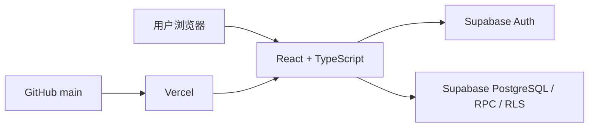

# 南洋美食地图（SG Food Map）🍜

面向新加坡高校学生的校园餐饮发现 Demo。用户可以在一个移动端优先的页面中完成餐厅搜索、筛选、比较、随机决策、查看详情、评价和拼桌。

- 在线体验：[https://sgfoodmap.vercel.app/](https://sgfoodmap.vercel.app/)
- 项目文档：[架构与交接说明](documentation/architecture.md)
- 技术栈：React 19、TypeScript、Vite、Tailwind CSS、Supabase、Vercel

> **项目说明**
>
> 这是个人作品集 Demo。当前餐厅、价格、评分、距离、菜单、优惠、活动和订单主要用于产品演示，不代表学校或商家的官方、实时信息。账号注册与登录使用 Supabase Auth；评价与拼桌功能连接演示数据库。

## 为什么做这个项目

校园餐饮信息分散在食堂、社群和地图应用中。学生在“今天吃什么”这件小事上，经常需要反复比较距离、价格、品类和同伴时间。

本项目尝试把完整决策路径集中到一个页面：

1. 发现附近餐厅；
2. 按学校、位置、价格和品类筛选；
3. 搜索店名、招牌菜或标签；
4. 查看详情、评价与优惠；
5. 随机选店，或发起拼桌。

我在这个个人项目中负责产品定义、交互梳理、AI 协作开发、测试验收与上线迭代。

## 核心功能

| 模块 | 当前能力 |
| --- | --- |
| 餐厅发现 | 浏览 NTU、NUS 的演示餐厅，支持列表与模拟地图切换 |
| 筛选与排序 | 按学校、区域、价格、品类、距离、评分和价格排序 |
| 智能搜索 | 支持多关键词、关键词换序、英文大小写统一和受限中文模糊匹配 |
| 决策辅助 | 随机选店，减少选择成本 |
| 餐厅详情 | 展示菜单、标签、优惠、评价与地图跳转 |
| 账号系统 | 邮箱注册，邮箱或校园昵称登录，找回与重置密码 |
| 用户互动 | 登录后可发布评价、发起拼桌、加入或退出队伍 |
| 个人中心 | 浏览记录、卡包、拼桌记录与演示订单 |
| 响应式体验 | 适配手机和桌面，Banner 支持滑动、圆点切换和轻点登录 |

### 搜索体验示例

- `印尼 鸡` 与 `鸡 印尼`：关键词顺序不影响结果；
- `印尼鸡`：可以匹配“印尼砸鸡”；
- `AYAM canteen`：英文不区分大小写；
- 多个关键词采用“全部满足”规则，减少无关结果；
- 无空格中文模糊匹配仅作用于店名和招牌菜，且相邻字符间最多允许插入两个字。

## 数据与功能边界

| 功能 | 数据来源与状态 |
| --- | --- |
| 餐厅列表 | 前端从 Supabase `restaurants` 表读取；仓库提供 16 条演示种子数据 |
| 价格、评分、距离、菜单 | 演示数据，不是实时商家数据 |
| 地图图钉与导航坐标 | 根据餐厅 ID 稳定生成的模拟坐标，不代表真实店铺位置 |
| 注册与登录 | Supabase Auth，是真实可用的账号流程 |
| 评价与拼桌 | 写入演示 Supabase 数据库 |
| 优惠券卡包 | 保存在当前浏览器的 `localStorage` 中，不跨设备同步 |
| 浏览记录 | 仅保存在当前页面会话的内存状态中 |
| 订单 | `src/data/userMock.ts` 中的模拟数据 |

## 技术方案



| 层级 | 方案 |
| --- | --- |
| 前端 | React 19、TypeScript、Tailwind CSS、Lucide React |
| 构建 | Vite 6 |
| 登录 | Supabase Auth |
| 数据 | Supabase PostgreSQL、RPC、Row Level Security |
| 部署 | GitHub + Vercel 自动部署 |

## 本地运行

建议使用 Node.js 20 LTS 或更新的 LTS 版本。

```bash
git clone https://github.com/rickon03/sgfoodmap.git
cd sgfoodmap
npm ci
```

复制环境变量模板：

```bash
cp .env.example .env.local
```

Windows PowerShell 可使用：

```powershell
Copy-Item .env.example .env.local
```

在 `.env.local` 中填写：

```env
VITE_SUPABASE_URL=
VITE_SUPABASE_ANON_KEY=
```

然后启动：

```bash
npm run dev
```

> 只能在前端使用 Supabase 的 publishable/anon key。不要把 `service_role` 或其他服务端密钥写入 `VITE_*` 变量，也不要提交 `.env.local`。

## Supabase 初始化

新建 Supabase 项目后，在 SQL Editor 中按以下顺序执行：

1. `supabase/01_init_db.sql`：创建餐厅、评价表并写入 16 条演示餐厅；
2. `supabase/02_profiles_username_unique.sql`：创建用户资料、唯一昵称和昵称登录能力；
3. `supabase/03_is_email_available.sql`：注册前检查邮箱；
4. `supabase/04_signup_precheck.sql`：合并邮箱与昵称预检查；
5. `supabase/05_team_members.sql`：创建拼桌成员关系及加入/退出 RPC；
6. `supabase/06_hardening.sql`：为评价与拼桌补充 RLS 策略。

注意：

- `supabase/legacy/resolve_login.sql` 是兼容旧环境的脚本，新项目不需要执行；
- `supabase/01_init_db.sql` 的演示数据插入不是完全幂等的，不要在同一项目中重复执行；
- 是否已在远端数据库执行这些策略，不能只通过本仓库判断，上线前应在 Supabase Dashboard 复核。

## 可用命令

| 命令 | 用途 |
| --- | --- |
| `npm run dev` | 启动本地开发环境 |
| `npm run typecheck` | 检查 TypeScript 类型 |
| `npm run build` | 生成生产版本 |
| `npm run preview` | 在本机预览生产构建 |

## 项目结构

```text
sgfoodmap/
├─ documentation/        # 架构、权限、变量和测试交接文档
├─ public/               # 静态资源
├─ src/
│  ├─ components/        # 页面功能与交互组件
│  ├─ data/              # 餐厅数据模型、筛选规则与模拟用户数据
│  ├─ lib/               # Supabase 客户端、登录与注册辅助逻辑
│  ├─ utils/             # 地图布局与占位图工具
│  ├─ App.tsx            # 主页面状态与功能组合
│  └─ main.tsx           # 应用入口
├─ supabase/             # 按执行顺序整理的建表、RPC 与安全策略
├─ vercel.json           # Vercel 构建配置
└─ package.json
```

## 构建与部署

```bash
npm run typecheck
npm run build
npm run preview
```

Vercel 配置：

- 构建命令：`npm run build`
- 输出目录：`dist`
- 环境变量：`VITE_SUPABASE_URL`、`VITE_SUPABASE_ANON_KEY`

当前项目连接 GitHub `main` 分支，推送后由 Vercel 自动发布。

## 当前限制与下一步

- 接入经过核验的真实商家、营业时间和菜单数据；
- 接入真实地图坐标与用户定位；
- 将卡包与浏览记录同步到用户账号；
- 增加自动化测试、持续集成、埋点和产品数据看板；
- 完善评论内容治理、权限策略和生产安全审查；
- 将大型页面组件逐步拆分，降低后续维护成本。

更多实现与风险边界见 [`documentation/architecture.md`](documentation/architecture.md)。
