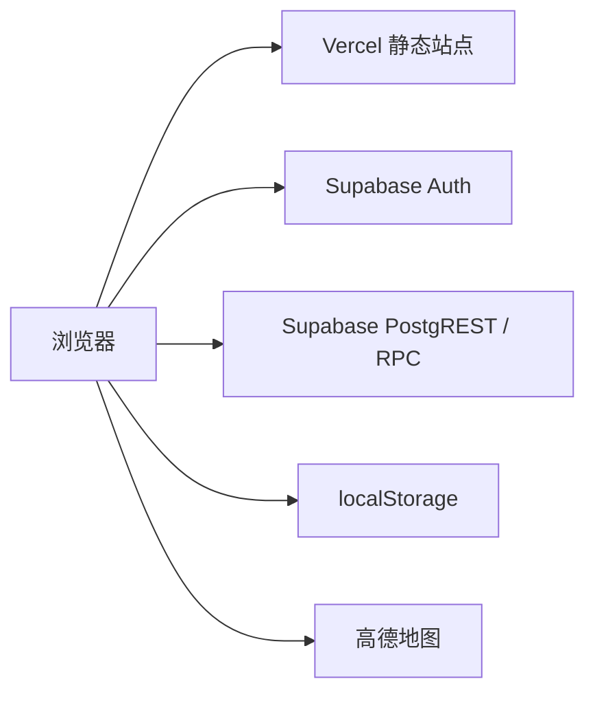

# 系统架构

## 产品定位

南洋美食地图是一个面向新加坡高校学生的校园餐饮发现 Demo。核心流程包括餐厅搜索与筛选、随机选店、详情与评价、优惠券、账号系统和拼桌。

关键假设：

- 当前餐厅及商业信息主要用于演示，不代表实时经营数据；
- 项目没有自建服务端，浏览器直接访问 Supabase；
- 数据安全依赖 Supabase 上实际生效的 RLS、函数权限和 Auth 配置。

## 技术栈

| 层级 | 实现 |
| --- | --- |
| 前端 | React 19、TypeScript、Tailwind CSS、Lucide React |
| 构建 | Vite 6，产物目录为 `dist` |
| 托管 | Vercel，连接 GitHub `main` 分支 |
| 登录 | Supabase Auth |
| 数据 | Supabase PostgreSQL、PostgREST、RPC、RLS |
| 浏览器状态 | React 内存与 `localStorage` |
| 外部跳转 | 高德地图 Web 导航链接 |

## 运行结构

浏览器中的 `src/lib/supabaseClient.ts` 使用项目 URL 和公开客户端 key 创建 Supabase 客户端。页面启动后：

1. 从 `restaurants` 读取餐厅；
2. 通过 `getSession` 恢复登录状态，并监听 Auth 状态变化；
3. 评价、拼桌和用户资料通过表或 RPC 访问；
4. 已领优惠券保存在浏览器本地，浏览记录只存在当前页面内存；
5. 订单来自 `src/data/userMock.ts`，地图坐标由餐厅 ID 生成。

## 认证与会话

- 注册：前端先调用邮箱和昵称预检查 RPC，再调用 Supabase Auth `signUp`；数据库触发器写入 `profiles`。
- 登录：邮箱直接登录；校园昵称先经 `resolve_login_email` 解析为邮箱。
- 会话：由 Supabase 客户端保存和刷新，`src/App.tsx` 监听认证状态。
- 找回密码：Supabase 发送恢复邮件，用户通过恢复链接返回后调用 `updateUser`。

## 信任边界

| 边界 | 说明 |
| --- | --- |
| 浏览器 → Supabase | 请求携带公开客户端 key；匿名与登录权限必须由 RLS 和 RPC 校验 |
| 浏览器 → `localStorage` | 优惠券记录没有服务端隔离，同一浏览器中的账号可能共享本地数据 |
| 浏览器 → 高德地图 | 会离开本站；当前传入的是模拟坐标 |
| GitHub → Vercel | 推送 `main` 会触发完整版本部署；环境变量由 Vercel 管理 |
| GitHub → GitHub Pages | 推送 `main` 会触发备用站部署；构建参数由 GitHub Actions Secrets 提供 |
| 浏览器 → 内置 Demo 数据 | Supabase 连接失败、超时、空结果或数据异常时，使用同一批 16 家演示餐厅 |

## 已知风险与假设

- 仓库 SQL 只描述预期状态，无法证明线上 Supabase 已执行相同策略；上线前需在 Dashboard 复核。
- `restaurants` 的 RLS 策略未在仓库中定义，公开读取能力依赖线上配置。
- `supabase/06_hardening.sql` 允许任意登录用户更新任意 `teams` 行，只限制人数范围，权限粒度偏宽。
- 昵称解析和邮箱可用性 RPC 对匿名用户开放，存在账号信息枚举风险。
- 评价的 `username` 由浏览器提交，数据库没有将其强制绑定到 `profiles`。
- `supabase/01_init_db.sql` 未声明前端支持的 `coupons` 字段，数据库结构与前端模型存在漂移。
- 地图坐标来自 `src/data/restaurants.ts` 的稳定伪坐标，不能用于真实导航。
- 当前没有自动化测试和 CI，合并到 `main` 前没有自动门禁。

项目没有定时任务，因此不创建 `cron.md`。项目没有嵌入式 AI、Webhook 或自动化代理，因此不创建 `automation.md`。

## 相关文档

- [关键流程](flows.md)
- [权限矩阵](permissions.md)
- [环境变量](variables.md)
- [测试覆盖](tests.md)
- [认证邮件](emails.md)
- [SEO 现状](seo.md)
